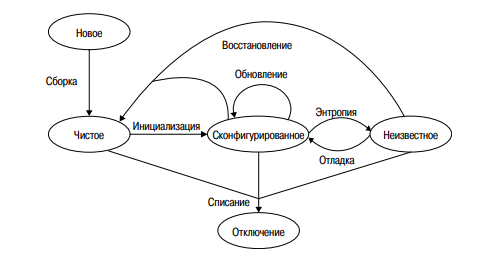

# Конспекты по книге "Системное и сетевое администрирование"
Т.Лимончелли, К.Хоган, С.Чейлап - 2009г.
## Содержание

- [Рабочие станции](#рабочие-станции)
  - [Основы](#основы)
- Серверы

## Рабочие станции

Под рабочей станцией подразумевается компьютер, выделенный для работы одного пользователя. Это может быть компьютер, ноутбук, а также виртуальная машина или док-станция.

Рабочие станции имеют свой жизненный цикл:

При этом пользоваться рабочей станцией можно только в сконфигурированном состоянии. Наша задача - следить за тем, чтобы машина находилась в нём. Для этого необходимо добиться, чтобы деградация ОС протекала как можно медленнее.

Главным фактором, влияющим на это, служит архитектурное решение поставщика ОС. Тем не менее архитектурное решение, принятое системным админимтратором, также может ускорить или замедлить этот процесс. Администратору важно найти баланс между предоставлением пользователям полного доступа и ограничением их прав в работе с ОС.

### Основы

Обслуживание ОС на рабочих станциях сводится к выполнению трёх основных задач:
+ Первоначальная установка системного ПО и приложений
+ Обновление системного ПО и приложений
+ Настройка сетевых параметров
  
Задачи этой "большой тройки" важно свести к централизованному и/или автоматизированному выполнению. По этой причине следует интересоваться у поставщиков о возможности автоматизации работы их продукта.

#### Установка ОС

У каждого поставщика есть своя система автоматической установки. Автоматизация экономит деньги, уменьшает количество ошибок установки и помогает создать одинаковую конфигурацию для всех рабочих станций.

Настройка автоматизированной системы установки требует усилий и времени, но облегчает дальнейшую работу.

**Частичная автоматизация лучше чем её полное отсутствие.** Для небольших систем задача по полной автоматизации может быть даже не вполне оправдана. Важно трезво оценивать вытекающие затраты и выгоды от перехода к полностью автоматической системе.

Существует подход, заключающийся в *клонировании диска*, но он менее предпочтителен чем автоматическая установка, в силу куда меньшей гибкости. Существуют также гибридные методы, когда клонированием диска выполняют минимальную установку ОС, после чего средствами автоматической системы устанавливают  дополнительные приложения и патчи.

Несмотря на то, что чаще всего компьютеры поставляются с предустановленной ОС, **лучшей парктикой является её переустановка** - за счёт этого мы приводим машину в известное состояние.

Чтобы быть уверенными в выполнении всех необходимых действий, используем *контрольные списки*.

#### Обновление системного ПО и приложений

Как и в случае с установкой, для обновления есть системы автоматизации. У каждого поставщика свои. Есть и кросс-платформенные системы.

Системы обновления ПО должны быть достаточно универсальными, чтобы они 
позволяли устанавливать новые приложения и обновлять уже имеющиеся, 
а также устанавливать патчи ОС.
Такие системы можно использовать также для внесения изменений на нескольких узлах сети. Для этих целей большинство систем позволяют упаковать в патч постустановочные скрипты.

Очевидным образом обновление отличается от первичной установки следующими нюансами:
+ Узел сети находится в рабочем состоянии (сконфигурирован).
+ Узел находится в офисе (при установке это не всегда так).
+ Отсутствует необходимость в физическом доступе.
+ Узел сети уже используется для работы, а значит нельзя допускать ошибок ведущим к потере данных.
+ Узел может не находиться в *"известном состоянии"*. По этой причине процесс обновления требует более точной настройки.
+ Узел может использоваться сотрудником прямо в процессе обновления. 
+ Узел может отсутствовать (например если это ноутбук). Необходимо как-то скоординировать процесс обновления таких узлов с их присутствием в сети.
+ Узел может иметь мультисистемную загрузку (несколько ОС на разных разделах)
  
Подход **"одна, несколько, много"**:
+ Одна. Прежде всего установите обновление на одну машину. Добейтесь, чтобы в процессе не возникали ошибки.
+ Несколько. Используя систему автоматического обновления, пробуем установить обновление на несколько машин.
+ Много. Убедившись, что процесс обновления не вызывает фатальных последствий, запускаем его на больших группах рабоччих станций.

Советы, как проводить процесс обновления:
+ Создаём строго определённое обновление для всех узлов сети, отправляем его на утверждение.
+ Составляем план оповещения, чтобы лишний раз не удивлять пользователей.
+ Для этапа "несколько" определяем критерий успешности вида: если нет сбоев, группа узлов растёт на n%, иначе сокращаем размер группы до одного узла.
+ Предусматриваем для пользователей возможность остановить процесс обновления. Отражаем в документации кто и как может потребовать остановки, а также что делать дальше.

#### Конфигурация сети

Речь идёт об автоматизации обновления сетевых параметров. Этот процесс может отличаться для отдельных узлов сети, а потому требует иных методов исполнения, нежели установка или обновление.

Чаще всего для этих целей используется DHCP сервер. Это тот компонент автоматизации, которым **пренебрегать категорически не рекомендуется.** 

Система DHCP должна иметь систему шаблонов. Это уменьшает вероятность ошибки в синтаксисе и 