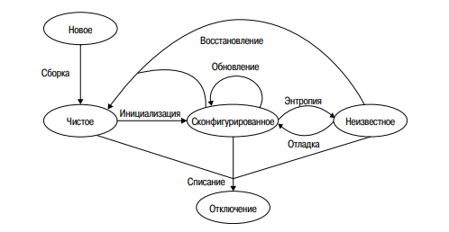

# Конспект по книге "Системное и сетевое администрирование"
Т.Лимончелли, К.Хоган, С.Чейлап - 2009г.

## Содержание

- [Рабочие станции](#рабочие-станции)
  - [Основы](#основы)
    - [Установка ОС](#установка-ос)
    - [Обновоение ПО](#обновление-системного-по-и-приложений)
    - [Конфигурация сети](#конфигурация-сети)
- [Серверы](#серверы)
  - [Основы](#основы)
    - [Покупка оборудования](#покупка-оборудования)
    - [Удалённый доступ](#удалённый-доступ)
    - [Зеркалирование загрузочных дисков](#зеркалирование-загрузочных-дисков)
  - [Тонкости](#тонкости)
    - [Повышение надёжности и удобства обслуживания](#поышение-надёжности-и-удобства-обслуживания)
    - [Качество или количество](#качество-или-количество)

## Рабочие станции

Под рабочей станцией подразумевается компьютер, выделенный для работы одного пользователя. Это может быть компьютер, ноутбук, а также виртуальная машина или док-станция.

Рабочие станции имеют свой жизненный цикл:

При этом пользоваться рабочей станцией можно только в сконфигурированном состоянии. Наша задача - следить за тем, чтобы машина находилась в нём. Для этого необходимо добиться, чтобы деградация ОС протекала как можно медленнее.

Главным фактором, влияющим на это, служит архитектурное решение поставщика ОС. Тем не менее архитектурное решение, принятое системным админимтратором, также может ускорить или замедлить этот процесс. Администратору важно найти баланс между предоставлением пользователям полного доступа и ограничением их прав в работе с ОС.

### Основы

Обслуживание ОС на рабочих станциях сводится к выполнению трёх основных задач:
+ Первоначальная установка системного ПО и приложений
+ Обновление системного ПО и приложений
+ Настройка сетевых параметров
  
Задачи этой "большой тройки" важно свести к централизованному и/или автоматизированному выполнению. По этой причине следует интересоваться у поставщиков о возможности автоматизации работы их продукта.

#### Установка ОС

У каждого поставщика есть своя система автоматической установки. Автоматизация экономит деньги, уменьшает количество ошибок установки и помогает создать одинаковую конфигурацию для всех рабочих станций.

Настройка автоматизированной системы установки требует усилий и времени, но облегчает дальнейшую работу.

**Частичная автоматизация лучше чем её полное отсутствие.** Для небольших систем задача по полной автоматизации может быть даже не вполне оправдана. Важно трезво оценивать вытекающие затраты и выгоды от перехода к полностью автоматической системе.

Существует подход, заключающийся в *клонировании диска*, но он менее предпочтителен чем автоматическая установка, в силу куда меньшей гибкости. Существуют также гибридные методы, когда клонированием диска выполняют минимальную установку ОС, после чего средствами автоматической системы устанавливают  дополнительные приложения и патчи.

Несмотря на то, что чаще всего компьютеры поставляются с предустановленной ОС, **лучшей парктикой является её переустановка** - за счёт этого мы приводим машину в известное состояние.

Чтобы быть уверенными в выполнении всех необходимых действий, используем *контрольные списки*.

#### Обновление системного ПО и приложений

Как и в случае с установкой, для обновления есть системы автоматизации. У каждого поставщика свои. Есть и кросс-платформенные системы.

Системы обновления ПО должны быть достаточно универсальными, чтобы они 
позволяли устанавливать новые приложения и обновлять уже имеющиеся, 
а также устанавливать патчи ОС.
Такие системы можно использовать также для внесения изменений на нескольких узлах сети. Для этих целей большинство систем позволяют упаковать в патч постустановочные скрипты.

Очевидным образом обновление отличается от первичной установки следующими нюансами:
+ Узел сети находится в рабочем состоянии (сконфигурирован).
+ Узел находится в офисе (при установке это не всегда так).
+ Отсутствует необходимость в физическом доступе.
+ Узел сети уже используется для работы, а значит нельзя допускать ошибок ведущим к потере данных.
+ Узел может не находиться в *"известном состоянии"*. По этой причине процесс обновления требует более точной настройки.
+ Узел может использоваться сотрудником прямо в процессе обновления. 
+ Узел может отсутствовать (например если это ноутбук). Необходимо как-то скоординировать процесс обновления таких узлов с их присутствием в сети.
+ Узел может иметь мультисистемную загрузку (несколько ОС на разных разделах)
  
Подход **"одна, несколько, много"**:
+ Одна. Прежде всего установите обновление на одну машину. Добейтесь, чтобы в процессе не возникали ошибки.
+ Несколько. Используя систему автоматического обновления, пробуем установить обновление на несколько машин.
+ Много. Убедившись, что процесс обновления не вызывает фатальных последствий, запускаем его на больших группах рабоччих станций.

Советы, как проводить процесс обновления:
+ Создаём строго определённое обновление для всех узлов сети, отправляем его на утверждение.
+ Составляем план оповещения, чтобы лишний раз не удивлять пользователей.
+ Для этапа "несколько" определяем критерий успешности вида: если нет сбоев, группа узлов растёт на n%, иначе сокращаем размер группы до одного узла.
+ Предусматриваем для пользователей возможность остановить процесс обновления. Отражаем в документации кто и как может потребовать остановки, а также что делать дальше.

#### Конфигурация сети

Речь идёт об автоматизации обновления сетевых параметров. Этот процесс может отличаться для отдельных узлов сети, а потому требует иных методов исполнения, нежели установка или обновление ПО.

Чаще всего для этих целей используется DHCP сервер. Это тот компонент автоматизации, которым **пренебрегать категорически не рекомендуется.** 

Система DHCP должна иметь систему шаблонов. Это уменьшает вероятность ошибки в синтаксисе и упрощает изменение конфигурации на группах узлов. Главное правильно сконфигурировать шаблоны.

Не очень хорошая практика - использование динамического DNS-сервера, т.к это излишне усложняет систему. Серверы должны иметь статический адрес и фиксированное доменное имя.

Управление сроками аренды DHCP может помочь согласовать время обновления конфигурации сетевых параметров.

## Серверы

В отличии от рабочих станций, сервера предназначены для использования многими пользователями. Следовательно он должен обладать достаточной надёжностью и бесперебойностью работы.

### Основы

#### Покупка оборудования

Для серверов, как ни странно, следует покупать серверное оборудование. Это особенно важно для долгосрочных и крупных проектов. Серверное оборудование обладает дополнительными ваозможностями, по сравнению с настольными рабочими станциями:
+ Расширяемость
+ Б`ольшая производительность ЦП
+ Высокопроизводительные системы ввода-вывода
+ Возможности модернизации
+ Возможность монтирования в стойку
+ Физический доступ проще (при обслуживании или ремонте не требуется доступ с боковых сторон)
+ Повышенная надёжность
+ Контракт на обслуживание
+ Альтернативные варианты управления

Следует с особым вниманием подойти к выбору поставщика. При использовании однотипного обрудования (от одного поставщика) упрощается обслуживание. Использование же разнотипного оборудования позволяет не зависить от одного поставщика.

#### Удалённый доступ

Для серверов необходима возможность удалённогообслуживания.

**Переключатель (или коммутатор) КВМ** - это устройство, которое позволяет нескольким устройствам использовать одну клавиатуру, экран и мышь.
Крупные физические коммутаторы КВМ довольно дорогие, но можно обойтись и вовсе без физического присутствия мыши, клавиатуры и экрана в машинном зале. Это позволяет сделать **IP-КВМ** - это настроенный консольный сервер, который позволяет управлять различными устройствами откуда угодно.

#### Зеркалирование загрузочных дисков

Загрузочный диск с операционной системой трудно заменить в случае его повреждения. Потому для ускорения процесса восстановления нужно соблюдать особые меры безопасности при эксплуатации сервера. Для загрузочного диска каждого сервера необходимо создавать зеркальный диск - т.е установлено два диска и при обновлении основного, обновляется и второй. Если один из дисков откажет, система автоматически переключается на второй. Чаще всего это можно сделать программно, а многие контроллеры жёстких дисков делают это и на аппаратном уровне. Этот метод называется *RAID 1*.

RAID-копирование, однако, защищает только от аппаратных ошибок, но не от программных или пользовательских - любые ошибочные изменения, внесённые на основной диск, тут же попадают и на зеркальный.

### Тонкости

#### Поышение надёжности и удобства обслуживания

**Одноцелевое устройство** - устройство, созданное для выполнения одной конкретной задачи. Есть определённые преимущества при использовании одноцелевых устройств, по сравнению с универсальными:
+ Независимая работа сервисов. Так, если нам потребуется перезагрузить универсальный сервер, остановятся все сервисы, работающие на нём. 
+ Более простая настройка
+ Дополнительные возможности специализированных систем.

Стоит также предусмотреть установку **резервных блоков питания** с избыточностью n+1, где n - количество БП, которые нужны для питания устройства при пиковой нагрузке. Также, если работоспособность системы должна быть очень высокой, каждый БП следует подключать к разным исотчникам питания, например к отдельным бесперебойникам.

**Избыточность n+1** относится к системам, которые продолжают работать даже после отказа одного из компонентов - это, к примеру, RAID-массивы, коммутаторы Ethernet с дополнительной многовходовой системой коммутации и т.п.

При **полной избыточности** два полных набора оборудования объединяются в отказоустойчивую конфигурацию. Первая система обеспечивает работу оборудования, а вторая бездействует в готовности взять на себя работу при сбое первой.

Есть также вариант, при котором системы с полной избыточностью используют **распределение нагрузки** - обе системы полноценно функционируют, распределяя между собой рабочую нагрузку. Если в одной из систем возникает сбой, другая система берёт на себя всю нагрузку. Естественно, каждая система в такой паре должна обладать достаточной мощностью, чтобы в одиночку обеспечивать работу системы.

#### Качество или количество

Естественной является рекомендация не экономить на серверном оборудовании. Однако существует и другая стратегия - купить несколько недорогих одинаковых серверов, которые будут давать сбои чаще. Если мы хорошо умеем справляться со сбоями, то эта стратегия выглядит более выгодной.

**Блейд-сервера** это логическое развитие технологии, связанной с этой стратегией. Один корпус содержит множество ячеек, в каждую из которых можно подключить плату с процессором и памятью (т.н *блейд*). Корпус обеспечивает питание, доступ к сети и системе управления. 

Программной реализацией подобного подхода является технология виртуальных серверов. На одном мощном сервере запускается множество виртуальных, каждый из которых выполняет свою функцию. Таким образом можно получить преимущества обоих подходов.

